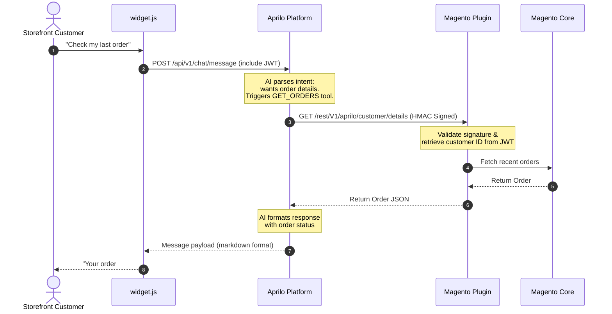
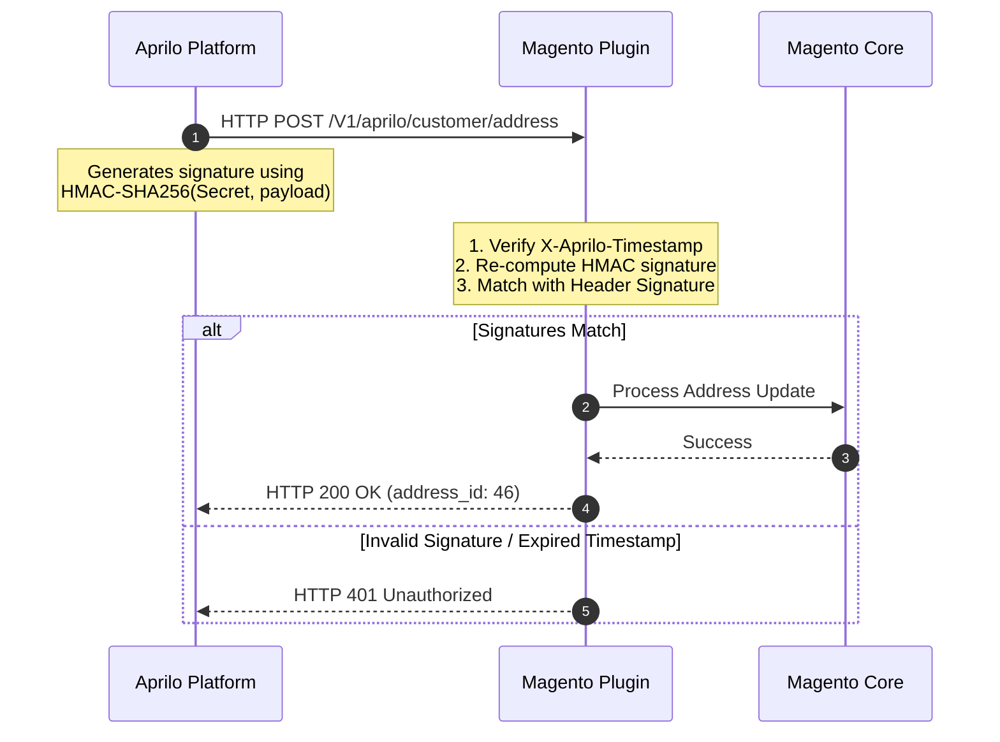
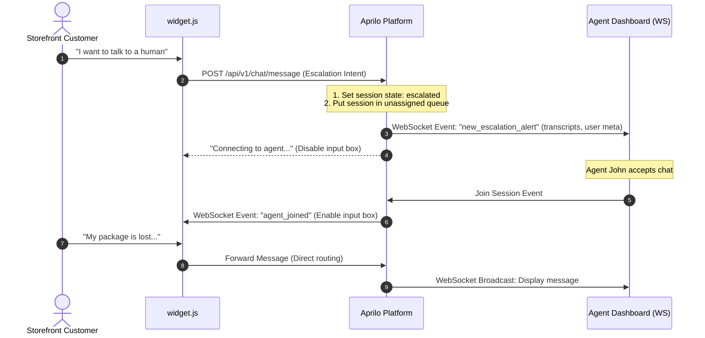

# System Architecture
## Aprilo Commerce Assistant — Version 1.0

---

## 1. Document Control
* **Document Name:** Aprilo Commerce Assistant System Architecture
* **Version:** 1.0
* **Date:** July 26, 2026
* **Status:** Draft / Initial Release
* **Author:** Antigravity AI (on behalf of the Google DeepMind Advanced Agentic Coding Team)

---

## 2. High-Level Component Architecture

```
                 ┌───────────────────────────────────────┐
                 │          Storefront Browser          │
                 │   ┌───────────────┐   ┌───────────┐   │
                 │   │  Store Page   │   │ widget.js │   │
                 │   └───────────────┘   └─────▲─────┘   │
                 └─────────────────────────────┼─────────┘
                                               │ WebSockets / HTTP
                                               ▼
  ┌─────────────────────────────────────────────────────────────────────────────┐
  │                              Aprilo Platform                                │
  │   ┌────────────────────┐   ┌──────────────────────┐   ┌─────────────────┐   │
  │   │  API Gateway &     │   │   AI Orchestrator    │   │  Vector DB      │   │
  │   │  Security Router   │   │   (State, Memory)    │   │  (pgvector)     │   │
  │   └─────────┬──────────┘   └───────────▲──────────┘   └────────▲────────┘   │
  │             │                          │                       │            │
  │             │ REST Calls               └───── RAG Lookup ──────┘            │
  │             ▼                                                               │
  │   ┌────────────────────┐   ┌──────────────────────┐                         │
  │   │  Agent Dashboard   │   │   Analytics Engine   │                         │
  │   │  (Live Escalation) │   │                      │                         │
  │   └────────────────────┘   └──────────────────────┘                         │
  └─────────────┬───────────────────────────────────────────────────────────────┘
                │
                │ Encrypted API Calls (HMAC)
                ▼
  ┌─────────────────────────────────────────────────────────────┐
  │                       Magento Server                        │
  │   ┌──────────────────────────┐   ┌──────────────────────┐   │
  │   │   CommerceAssistant      │   │  Magento Core APIs   │   │
  │   │   Plugin (Controllers)   │   │  (Catalog, Orders)   │   │
  │   └─────────┬────────────────┘   └──────────▲───────────┘   │
  │             │                               │               │
  │             └──────── Internal Query ───────┘               │
  └─────────────────────────────────────────────────────────────┘
```

---

## 3. Core Sequence Flows

### 3.1. Dynamic Tool Calling & Magento Query
This diagram illustrates the sequence when a customer asks a question requiring database retrieval (e.g., *"Where is my order?"*).



### 3.2. Platform Inbound Security validation
Flow detailing signature validation of platform-triggered requests.



### 3.3. Human Handoff Workflow
Flow detailing how a customer is seamlessly transitioned to a human agent when the AI cannot resolve the request.


