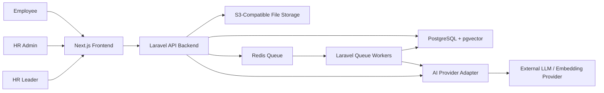
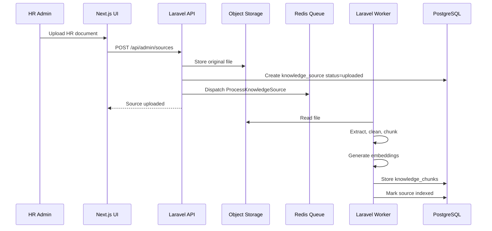
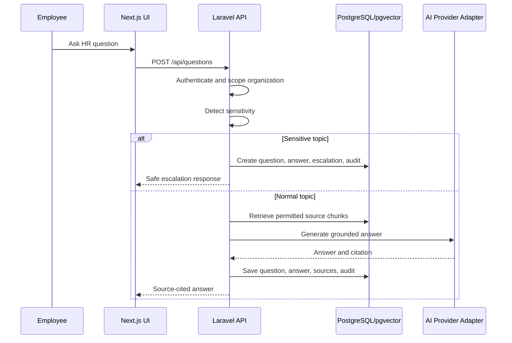

# High-Level Design v0.1 - AI HR Knowledge and Workflow Assistant

## 1. Document Control

| Field | Value |
|---|---|
| Product | AI HR Knowledge & Workflow Assistant |
| Document Type | High-Level Design |
| Version | 0.1 |
| Status | Draft for Sprint 0 review |
| Stack | Next.js frontend + Laravel API backend + PostgreSQL/pgvector + Redis queues + S3-compatible storage |
| Primary Workflow | HR Policy Q&A + Escalation + ROI |

## 2. Purpose

This High-Level Design defines the architecture for the first MVP of the AI HR Knowledge & Workflow Assistant. It explains the major system components, responsibilities, data flow, security boundaries, deployment model, and non-functional requirements.

The goal is to build the first Operational AI capability pack without creating a one-off chatbot. The architecture must support the HRMS MVP now and remain reusable for future ecommerce, ERP, CRM, and support capability packs.

## 3. Scope

### In Scope

- Employee HR question answering.
- HR document upload.
- Document parsing and indexing.
- Source-grounded answer generation.
- Role-aware retrieval.
- Sensitive-topic handling.
- HR escalation queue.
- Feedback capture.
- Audit logs.
- ROI dashboard.

### Out of Scope

- HRMS write actions.
- Payroll automation.
- Benefits enrollment automation.
- Performance-review automation.
- Marketplace.
- Full agent builder.
- Enterprise SSO.
- Multi-region deployment.

## 4. Architecture Goals

1. Build a trustworthy HR assistant with source-cited answers.
2. Keep customer data tenant-scoped.
3. Use Laravel for backend business rules and APIs.
4. Use queues for document processing and future integrations.
5. Use PostgreSQL as the system of record.
6. Use pgvector for MVP semantic retrieval.
7. Keep the AI provider replaceable through an abstraction layer.
8. Capture audit and ROI data from day one.
9. Avoid over-engineering before pilot validation.

## 5. System Context

## 6. Container Architecture

| Container | Responsibility |
|---|---|
| Next.js Frontend | Employee assistant UI, admin source management, escalation queue, dashboard, settings |
| Laravel API | Auth, organization scoping, roles, API endpoints, business rules, AI orchestration |
| PostgreSQL | Organizations, users, sources, chunks, questions, answers, escalations, feedback, audit events, metrics |
| pgvector | Semantic search over knowledge chunks |
| Redis | Queue backend for document parsing, embedding, retries, future integration jobs |
| Laravel Workers | Background document processing, embedding generation, async jobs |
| Object Storage | Original uploaded HR documents |
| AI Provider | Answer generation, embeddings, sensitivity classification |

## 7. Major Modules

### 7.1 Frontend Module

Responsibilities:

- Login screen.
- Employee Ask HR screen.
- Admin Sources screen.
- Admin Escalations screen.
- ROI Dashboard.
- Settings screen.
- API client wrapper.

### 7.2 Auth and Authorization Module

Responsibilities:

- Authenticate users with Laravel Sanctum.
- Enforce organization membership.
- Enforce roles: owner, HR admin, employee.
- Protect admin routes.
- Apply Laravel Policies/Gates for source, escalation, and metrics access.

### 7.3 Organization Workspace Module

Responsibilities:

- Tenant workspace.
- Organization settings.
- User membership.
- Assistant active/paused state.
- Default time-saved assumptions.

### 7.4 Knowledge Source Module

Responsibilities:

- Upload HR documents.
- Store source metadata.
- Track indexing status.
- Apply access scopes.
- Deactivate sources.

### 7.5 Document Processing Module

Responsibilities:

- Extract text from uploaded sources.
- Split text into chunks.
- Generate embeddings.
- Store chunks with source metadata.
- Mark source indexed or failed.

### 7.6 Retrieval Module

Responsibilities:

- Receive employee question.
- Filter sources by organization and role.
- Retrieve relevant chunks through pgvector.
- Return source context for answer generation.

### 7.7 AI Answer Module

Responsibilities:

- Detect sensitive topics.
- Build answer request with retrieved context.
- Call AI provider abstraction.
- Generate source-grounded answer.
- Trigger fallback if answer is unsupported.
- Return answer and citations.

### 7.8 Escalation Module

Responsibilities:

- Create escalation for sensitive, unsupported, or user-requested questions.
- Show open escalations to HR admins.
- Allow resolution notes and status updates.

### 7.9 Audit Module

Responsibilities:

- Log source uploads.
- Log questions.
- Log answers.
- Log cited sources.
- Log escalations.
- Log feedback.
- Preserve pilot review trail.

### 7.10 Metrics Module

Responsibilities:

- Total questions.
- Resolved questions.
- Escalated questions.
- Resolution rate.
- Helpful rate.
- Estimated time saved.
- Top topics.
- Knowledge gaps.

## 8. Core Data Flow

### 8.1 Source Upload Flow

### 8.2 Employee Q&A Flow

## 9. Security Architecture

### Security Principles

1. Organization data is tenant-scoped.
2. All customer-owned tables include organization_id.
3. API requests require authentication except login.
4. Admin APIs require HR admin or owner role.
5. Source retrieval must filter by organization and access scope.
6. Sensitive HR topics escalate instead of autonomous advice.
7. Every question produces an audit trail.
8. Highly sensitive HR records are excluded from MVP ingestion.

### MVP Access Model

| Role | Access |
|---|---|
| Owner | Organization settings, sources, escalations, dashboard |
| HR Admin | Sources, escalations, dashboard, employee assistant |
| Employee | Ask HR questions, view own answers |

## 10. Deployment Architecture

### MVP Deployment

| Component | Deployment |
|---|---|
| Frontend | Vercel |
| Laravel API | Managed PHP/Laravel hosting or container platform |
| Queue worker | Same backend environment, separate worker process |
| Scheduler | Laravel scheduler process |
| Database | Managed PostgreSQL with pgvector |
| Redis | Managed Redis |
| File storage | S3-compatible object storage |

## 11. Non-Functional Requirements

| Area | Requirement |
|---|---|
| Security | Tenant isolation, role checks, audit logs |
| Reliability | Document jobs retry on failure |
| Performance | Employee Q&A should respond within acceptable pilot latency |
| Scalability | Modular monolith first; services can split later |
| Maintainability | Clear Laravel services, policies, jobs, and controllers |
| Observability | Error monitoring and audit/event logs |
| Privacy | Minimal employee metadata in MVP |
| Cost control | Track AI usage per question/answer |

## 12. Key Architecture Decisions

| Decision | Choice |
|---|---|
| Backend style | Laravel modular monolith |
| Frontend style | Next.js SaaS app |
| Vector search | pgvector in Postgres |
| Queue system | Redis + Laravel Queues/Horizon |
| Auth | Laravel Sanctum |
| AI provider | Abstracted service interface |
| First integration scope | Document upload only |
| HRMS API | Later, after workflow validation |

## 13. Risks and Mitigations

| Risk | Mitigation |
|---|---|
| AI gives unsupported policy answer | Source grounding, fallback, escalation |
| User sees wrong-source data | Organization scoping and source access filtering |
| Document parsing fails | Queue status, failed state, retry, manual review |
| AI cost grows | Track usage, model routing later |
| Backend becomes too broad | Keep modular monolith and P0 cut line |
| Pilot customer demands HRMS write actions | Keep MVP scope document-first |

## 14. HLD Conclusion

The high-level architecture supports the first HRMS Operational AI MVP while preserving a platform foundation. The system is intentionally simple but not fragile: Laravel owns the backend, Next.js owns the UX, Postgres owns the system of record, pgvector supports MVP retrieval, and Redis queues support asynchronous document processing.

This HLD is ready to guide Sprint 0 and Sprint 1 planning.
