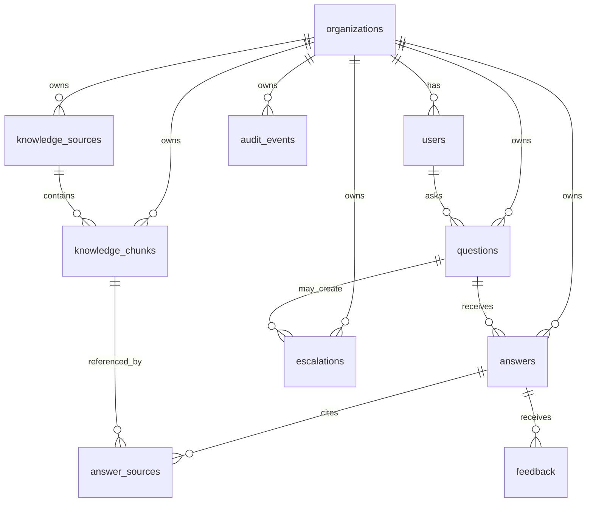

# Data Model v0.1

## Product

AI HR Knowledge & Workflow Assistant

## Purpose

Define the first database structure for the MVP. This is a product-level data model, not final migration code.

## Core Entities

### organizations

Represents a customer workspace.

| Field | Notes |
|---|---|
| id | Unique organization ID |
| name | Organization name |
| status | active, paused, archived |
| created_at | Created date |
| updated_at | Updated date |

### users

Represents a person using the product.

| Field | Notes |
|---|---|
| id | Unique user ID |
| organization_id | Customer workspace |
| email | User email |
| name | User name |
| role | owner, hr_admin, employee |
| status | invited, active, disabled |
| created_at | Created date |
| updated_at | Updated date |

### knowledge_sources

Represents an uploaded HR document, FAQ, or approved knowledge source.

| Field | Notes |
|---|---|
| id | Unique source ID |
| organization_id | Customer workspace |
| title | Source title |
| source_type | pdf, docx, txt, markdown, faq |
| file_path | Storage path if file-based |
| status | uploaded, indexing, indexed, failed, inactive |
| access_scope | all_employees, managers, hr_only, custom |
| uploaded_by | User ID |
| created_at | Created date |
| updated_at | Updated date |

### knowledge_chunks

Represents searchable pieces of knowledge from sources.

| Field | Notes |
|---|---|
| id | Unique chunk ID |
| organization_id | Customer workspace |
| source_id | Source record |
| chunk_text | Extracted text |
| chunk_index | Order in source |
| section_title | Optional section title |
| embedding | Vector embedding |
| metadata | JSON metadata |
| created_at | Created date |

### questions

Represents employee questions.

| Field | Notes |
|---|---|
| id | Unique question ID |
| organization_id | Customer workspace |
| user_id | Asking user |
| question_text | Original question |
| topic | Detected or assigned topic |
| sensitivity_status | normal, sensitive, unknown |
| status | answered, escalated, unsupported |
| created_at | Created date |

### answers

Represents assistant responses.

| Field | Notes |
|---|---|
| id | Unique answer ID |
| organization_id | Customer workspace |
| question_id | Related question |
| answer_text | Assistant answer |
| answer_status | answered, fallback, escalated |
| confidence_label | high, medium, low |
| model_provider | Provider used |
| model_name | Model used |
| created_at | Created date |

### answer_sources

Connects answers to cited knowledge chunks.

| Field | Notes |
|---|---|
| id | Unique record ID |
| organization_id | Customer workspace |
| answer_id | Related answer |
| source_id | Cited source |
| chunk_id | Cited chunk |
| citation_label | Display label |
| created_at | Created date |

### escalations

Represents questions requiring HR review.

| Field | Notes |
|---|---|
| id | Unique escalation ID |
| organization_id | Customer workspace |
| question_id | Related question |
| user_id | Asking user |
| category | unsupported, sensitive, low_confidence, user_requested |
| status | open, in_progress, resolved |
| assigned_to | HR admin user ID |
| resolution_note | HR response or internal note |
| created_at | Created date |
| resolved_at | Resolution date |

### feedback

Represents employee feedback on an answer.

| Field | Notes |
|---|---|
| id | Unique feedback ID |
| organization_id | Customer workspace |
| answer_id | Related answer |
| user_id | User giving feedback |
| rating | helpful, not_helpful |
| comment | Optional |
| created_at | Created date |

### audit_events

Represents product audit trail.

| Field | Notes |
|---|---|
| id | Unique event ID |
| organization_id | Customer workspace |
| actor_user_id | User who caused event |
| event_type | source_uploaded, question_asked, answer_generated, escalation_created, etc. |
| entity_type | source, question, answer, escalation, user |
| entity_id | Related entity ID |
| metadata | JSON event data |
| created_at | Event date |

### organization_settings

Represents organization-level configuration.

| Field | Notes |
|---|---|
| id | Unique record ID |
| organization_id | Customer workspace |
| minutes_saved_per_resolved_question | Default 5 |
| default_escalation_owner | HR admin user ID |
| assistant_status | active, paused |
| created_at | Created date |
| updated_at | Updated date |

## Entity Relationship Summary

## Tenant Isolation Rule

Every customer-owned table must include organization_id.

All queries must filter by organization_id before returning data to the user.

## Data Retention Defaults

MVP recommendation:

- Uploaded documents: retained until admin deletes or deactivates.
- Extracted chunks: deleted when source is deleted.
- Questions/answers/logs: retained during pilot for audit and ROI.
- Deleted customer workspace: hard delete or scheduled purge after confirmation.

## Sensitive Data Rule

The MVP should avoid ingesting highly sensitive HR data.

Do not intentionally store:

- Payroll records.
- Medical records.
- Performance reviews.
- Employee investigation files.
- Legal claims.

## Founder Decision

Use this data model as the starting point for Sprint 0 schema design. Keep the structure simple, tenant-scoped, and audit-ready.
