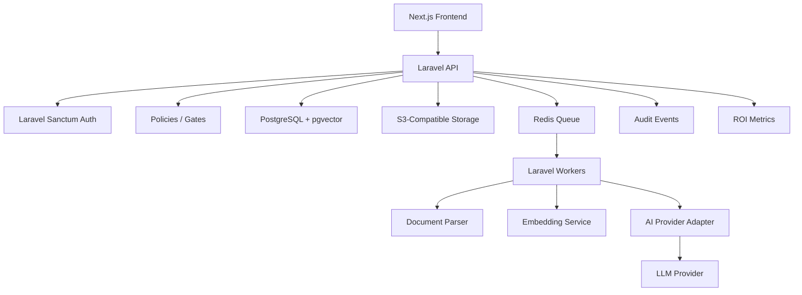

# Laravel Backend Stack Decision v0.1

## Product

AI HR Knowledge & Workflow Assistant

## Decision Summary

Laravel is a strong backend choice for this product. If we want a serious API and service foundation from the beginning, the recommended architecture should become:

Next.js frontend + Laravel API backend + PostgreSQL/pgvector + Redis queues + object storage + AI provider abstraction.

This is more backend-heavy than the earlier Next.js/Supabase-first recommendation, but it fits the product better if we expect to build real SaaS backend services: tenant isolation, RBAC, document processing, audit logs, AI orchestration, background jobs, integrations, and future HRMS/ecommerce/ERP connectors.

## Recommended Laravel-Based Stack

| Layer | Recommendation | Reason |
|---|---|---|
| Frontend | Next.js + TypeScript | Modern SaaS UI, dashboards, assistant UX |
| Backend API | Laravel | Strong API layer, SaaS backend logic, queues, policies, jobs, events |
| Database | PostgreSQL | Reliable relational model for SaaS and audit-heavy workflows |
| Vector search | PostgreSQL + pgvector | Keeps MVP retrieval simple without separate vector DB |
| Auth | Laravel Sanctum | Good for first-party SPA/API authentication |
| Authorization | Laravel Policies/Gates | Clean role and permission enforcement |
| Queues | Redis + Laravel Queues/Horizon | Required for document parsing, embeddings, AI jobs, emails, retries |
| File storage | S3-compatible storage | Store uploaded HR documents safely |
| AI layer | Laravel service interface / adapter | Keeps OpenAI/Anthropic/Gemini replaceable |
| Audit logs | PostgreSQL tables via Laravel events | Strong trust and compliance foundation |
| Admin APIs | Laravel REST API | Clean contract for frontend |
| Deployment | Laravel app server + queue worker + scheduler | Production-friendly backend structure |

## Why Laravel Fits This Product

### 1. Backend complexity is real

This product is not just a static dashboard. It needs:

- Multi-tenant organization workspaces.
- Role-based permissions.
- HR document upload and indexing.
- Long-running background jobs.
- AI provider calls.
- Escalation workflows.
- Audit logs.
- ROI metrics.
- Future integrations with HRMS, ecommerce, ERP, CRM, helpdesk, Slack, and Teams.

Laravel is very good at this type of backend.

### 2. Queues are central

Document upload should not block the UI.

Laravel queues can handle:

- PDF/DOCX text extraction.
- Chunking.
- Embedding generation.
- Source indexing.
- Retry on failure.
- AI processing jobs.
- Email/notification jobs.
- Integration sync jobs later.

### 3. Laravel has strong authorization patterns

For HR data, permissions matter. Laravel Policies and Gates are useful for enforcing:

- Who can upload sources.
- Who can view escalations.
- Who can access admin dashboards.
- Which user can ask questions in which organization.
- Which source scopes are allowed.

### 4. Laravel is good for audit-heavy products

The product needs logs for:

- Source uploads.
- Questions asked.
- Answers generated.
- Sources cited.
- Escalations created.
- Feedback submitted.
- Admin changes.

Laravel events and model observers can support this cleanly.

### 5. Laravel leaves room for future integrations

Future connectors can become Laravel services/jobs:

- OrangeHRM connector.
- Zoho People connector.
- BambooHR connector.
- Shopify connector.
- WooCommerce connector.
- Odoo/ERPNext connector.
- HubSpot/Salesforce connector.

This fits the long-term platform strategy.

## Recommended Architecture

## Service Boundaries

Laravel should own:

- Auth.
- Organizations.
- Users and roles.
- Source upload metadata.
- Document processing jobs.
- Retrieval API.
- AI answering API.
- Escalation API.
- Feedback API.
- Audit logging.
- ROI metrics.
- Integrations.

Next.js should own:

- Employee assistant UI.
- Admin dashboard UI.
- Source management UI.
- Escalation queue UI.
- ROI dashboard UI.
- Login screens if using Laravel Sanctum SPA flow.

## Data Model Impact

The existing data model still works. Laravel can implement it directly with migrations and Eloquent models:

- Organization.
- User.
- OrganizationSetting.
- KnowledgeSource.
- KnowledgeChunk.
- Question.
- Answer.
- AnswerSource.
- Escalation.
- Feedback.
- AuditEvent.

## AI / Document Processing Notes

Laravel can orchestrate document processing, but we may still use a small Python worker later if PDF/DOCX extraction quality becomes a bottleneck.

MVP options:

1. Laravel-only parsing for simple PDF/DOCX/TXT.
2. Laravel queue dispatches to a Python parsing worker for higher-quality extraction.

Recommendation:

Start Laravel-only if documents are simple. Add Python worker only if extraction quality becomes a real pilot issue.

## Laravel vs Next.js-Only Backend

| Area | Next.js-only backend | Laravel backend |
|---|---|---|
| MVP speed | Fast | Medium-fast |
| Backend structure | Lightweight | Strong |
| Queues/jobs | Requires extra setup | Native strength |
| API discipline | Good enough | Strong |
| RBAC/policies | Custom | Mature |
| Audit/event logic | Custom | Mature |
| Integrations | Possible | Strong |
| Long-term backend platform | Medium | Strong |

## Recommended Decision

Use Laravel for backend if:

- We want a serious backend API foundation.
- We expect background jobs and integrations to matter soon.
- The founding team is comfortable with Laravel/PHP.
- We want backend code to remain organized as the platform grows.

Use Next.js/Supabase-only if:

- We want the fastest possible prototype.
- The MVP is only a clickable/demo product.
- Backend complexity is intentionally delayed.

## Founder Recommendation

For this company, Laravel backend is a better strategic choice than a Next.js-only backend.

Recommended final MVP stack:

- Next.js + TypeScript frontend.
- Laravel API backend.
- PostgreSQL + pgvector.
- Redis queues.
- S3-compatible document storage.
- Laravel Sanctum auth.
- Laravel Policies/Gates for authorization.
- AI provider abstraction inside Laravel.

This gives us speed, seriousness, and a clean path to future operational AI services.
