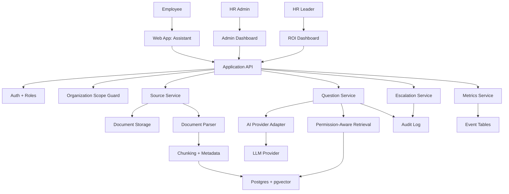
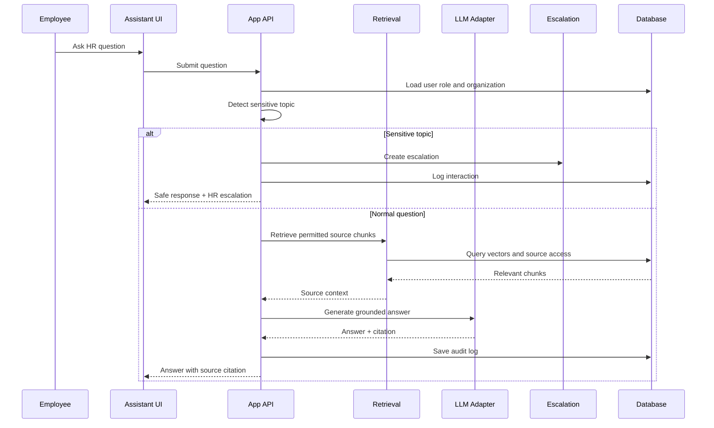

# System Architecture v0.1

## Product

AI HR Knowledge & Workflow Assistant

## Architecture Goal

Build the first capability pack on top of a reusable Operational AI platform foundation.

The system should support:

- Customer workspaces.
- HR knowledge ingestion.
- Source-grounded answers.
- Permission-aware retrieval.
- Escalation to HR.
- Auditability.
- ROI measurement.

## High-Level Architecture

## Core Modules

### 1. Workspace Module

Purpose:

Create tenant isolation for each customer.

Responsibilities:

- Organization records.
- User membership.
- Organization-level settings.
- Workspace status.

MVP rule:

Every query must be scoped to organization.

### 2. Identity and Role Module

Purpose:

Control access to product areas and HR knowledge.

Initial roles:

- Owner.
- HR Admin.
- Employee.

Later roles:

- Manager.
- IT/Security.
- External partner.

MVP rule:

Employees cannot access admin pages or admin-only sources.

### 3. Source Management Module

Purpose:

Let HR admins upload and manage approved HR knowledge.

Responsibilities:

- File upload.
- Source metadata.
- Source status.
- Access scope.
- Source deactivation.

MVP rule:

Inactive sources must not be used for answering.

### 4. Document Processing Module

Purpose:

Transform uploaded documents into retrievable knowledge.

Pipeline:

1. Upload file.
2. Extract text.
3. Clean text.
4. Split into chunks.
5. Add metadata.
6. Create embeddings.
7. Store chunks and vectors.
8. Mark source indexed.

MVP rule:

Each answer citation must trace back to source and chunk.

### 5. Question and Answer Module

Purpose:

Answer employee HR questions safely.

Flow:

1. Receive question.
2. Check user and organization.
3. Detect sensitive topic.
4. Retrieve permitted source chunks.
5. Generate source-grounded answer.
6. Apply fallback if support is weak.
7. Store question, answer, sources, and status.

MVP rule:

The assistant should not invent policy.

### 6. Escalation Module

Purpose:

Route unresolved or sensitive questions to HR.

Responsibilities:

- Create escalation.
- Categorize reason.
- Assign HR owner.
- Track status.
- Store HR resolution note.

MVP rule:

Escalation is a safety feature, not a failure.

### 7. Audit Module

Purpose:

Create trust and operational reviewability.

Records:

- Question.
- Answer.
- Sources used.
- User.
- Role.
- Confidence/fallback status.
- Escalation status.
- Feedback.
- Timestamp.

MVP rule:

Every employee question creates an audit record.

### 8. Metrics Module

Purpose:

Measure product value.

Metrics:

- Total questions.
- Resolution rate.
- Escalation rate.
- Helpful rate.
- Estimated time saved.
- Top topics.
- Knowledge gaps.

MVP rule:

Time saved must be labeled as an estimate.

## AI Answering Flow

## Data Boundary

MVP stores:

- Organization data.
- User identity and role.
- Approved HR documents.
- Extracted text chunks.
- Questions and answers.
- Source references.
- Feedback.
- Escalations.
- Metrics events.

MVP avoids:

- Payroll records.
- Medical records.
- Performance reviews.
- Employee investigations.
- Legal case material.
- Benefits claims data.
- HRMS write actions.

## Security Principles

1. Tenant isolation by default.
2. Role checks before data access.
3. Source access filtering before retrieval.
4. Audit log for every question.
5. Minimal employee metadata.
6. Sensitive-topic escalation.
7. No autonomous high-risk HR actions.

## Architecture Decision

Build a modular monolith first.

Meaning:

- One application.
- Clear internal modules.
- Shared database.
- No microservices yet.

Why:

This is faster, simpler, and easier to secure for the MVP. If the product works, modules can later split into services.
