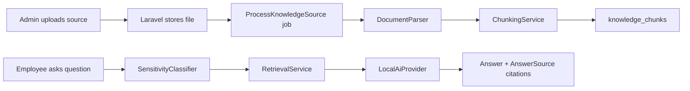

# Sprint 2 Implementation Status

## Executive Summary

Sprint 2 is implemented as the first working source-grounded answer workflow.

The assistant can now:

- Accept approved HR source uploads.
- Parse TXT, Markdown, and DOCX files locally.
- Attempt best-effort PDF text extraction.
- Split documents into searchable chunks.
- Index chunks against the organization.
- Retrieve relevant chunks for employee questions.
- Produce conservative source-cited answers.
- Show citations in the employee UI.
- Show indexed chunk counts in the HR admin source table.

This is not yet production-grade RAG. It is a real pilot workflow using local lexical retrieval. The next production upgrade is embeddings, pgvector similarity search, and provider-backed answer generation.

## Implemented Backend Capabilities

| Capability | Status | Notes |
| --- | --- | --- |
| TXT parsing | Complete | Reads and normalizes plain text. |
| Markdown parsing | Complete | Reads Markdown as text. |
| DOCX parsing | Complete | Extracts text from `word/document.xml`. |
| PDF parsing | Partial | Best-effort only; production needs a dedicated PDF parser. |
| Chunking | Complete | Paragraph-aware chunks with overlap. |
| Source indexing | Complete | Stores chunks and marks source as indexed or failed. |
| Local retrieval | Complete | Lexical scoring across indexed chunks. |
| Access control | Complete | Employee users cannot retrieve HR-only sources. |
| Source-cited answers | Complete | Answers include citation labels and source records. |
| Safe fallback | Complete | No source match means no invented answer. |

## Implemented Frontend Capabilities

| Screen | Update |
| --- | --- |
| Ask HR | Shows cited source cards under grounded answers. |
| Knowledge Sources | Shows indexed chunk count per source. |
| Knowledge Sources | Updated copy to reflect real indexing. |

## Answer Behavior

| Scenario | Behavior |
| --- | --- |
| Indexed source matches question | Returns a source-cited answer. |
| No indexed source matches | Returns safe fallback. |
| Sensitive question | Creates HR escalation and does not answer directly. |
| HR-only source asked by employee | Excluded from retrieval. |

## Current Technical Design

## Verification

| Check | Result |
| --- | --- |
| Backend tests | Passed: 4 tests, 34 assertions |
| Frontend source lint | Passed |
| Frontend TypeScript | Passed |
| Frontend production build | Passed |

## Founder Decisions

| Decision | Reason |
| --- | --- |
| Implement local lexical retrieval before embeddings | Gives a testable pilot workflow without requiring external AI keys. |
| Keep provider abstraction in place | Allows OpenAI, Azure OpenAI, Bedrock, or other providers later. |
| Keep safe fallback as default | Trust is more important than answer volume during early pilots. |
| Show citations visibly | Creates user trust and HR reviewability from day one. |
| Treat PDF parsing as partial | Avoids false confidence; production needs stronger extraction. |

## Limitations

- Retrieval is lexical, not semantic.
- No embedding provider is connected yet.
- pgvector is prepared in migrations but not used by local retrieval yet.
- Local answer generation summarizes excerpts conservatively; it is not yet LLM-generated.
- Complex PDFs may fail or extract incomplete text.
- Source reprocessing is basic and does not yet expose detailed job logs in the UI.

## Recommended Sprint 3

1. Add OpenAI or Azure OpenAI embedding provider.
2. Switch retrieval to pgvector similarity search in PostgreSQL.
3. Add hybrid retrieval: keyword + vector.
4. Add LLM answer generation with strict source-only prompt rules.
5. Add citation-level confidence scores.
6. Add source processing status details in the admin UI.
7. Add duplicate document/version handling.
8. Add production PDF parser support.
